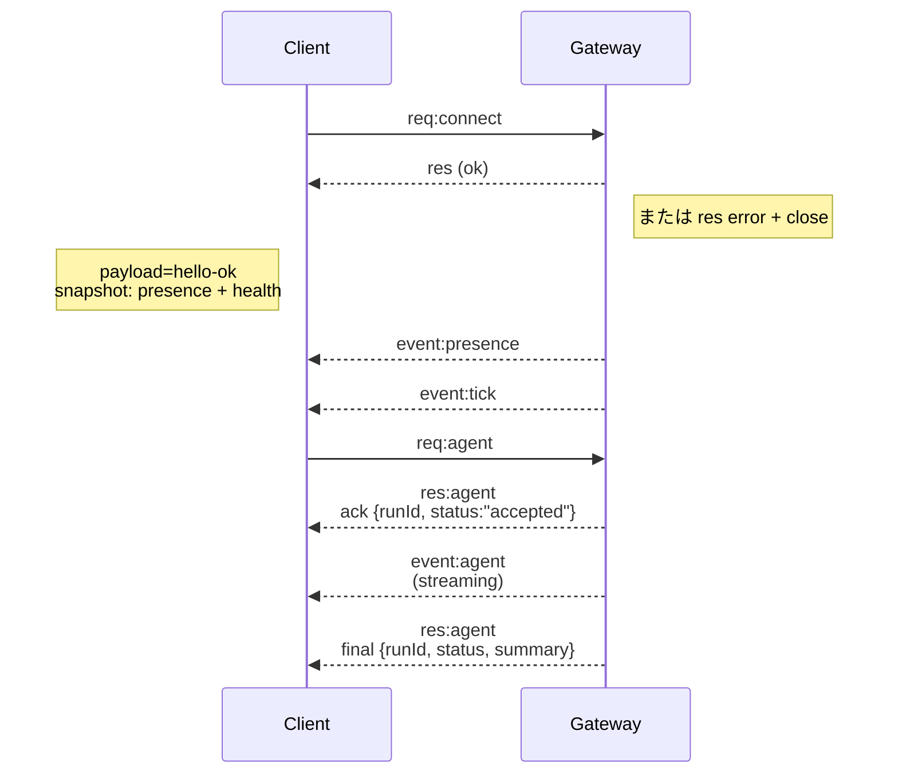

# ゲートウェイアーキテクチャ

# Gateway architecture

Last updated: 2026-01-22

## 概要

* 単一の長寿命の**Gateway**がすべてのメッセージングサーフェス（WhatsApp via Baileys、Telegram via grammY、Slack、Discord、Signal、iMessage、WebChat）を所有します。
* コントロールプレーンクライアント（macOSアプリ、CLI、Web UI、自動化）は、設定されたバインドホスト（デフォルトは`127.0.0.1:18789`）上の**WebSocket**経由でGatewayに接続します。
* **ノード**（macOS/iOS/Android/headless）も**WebSocket**経由で接続しますが、明示的なcaps/commandsを持つ`role: node`を宣言します。
* ホストごとに1つのGatewayがあり、それがWhatsAppセッションを開く唯一の場所です。
* **canvas host**はGateway HTTPサーバーによって提供されます：
  * `/__openclaw__/canvas/`（エージェント編集可能なHTML/CSS/JS）
  * `/__openclaw__/a2ui/`（A2UIホスト）
    これはGatewayと同じポート（デフォルトは`18789`）を使用します。

## コンポーネントとフロー

### Gateway (daemon)

* プロバイダー接続を維持します。
* 型付けされたWS API（リクエスト、レスポンス、サーバープッシュイベント）を公開します。
* JSON Schemaに対して受信フレームを検証します。
* `agent`、`chat`、`presence`、`health`、`heartbeat`、`cron`のようなイベントを発行します。

### クライアント（macアプリ / CLI / web管理）

* クライアントごとに1つのWS接続。
* リクエストを送信します（`health`、`status`、`send`、`agent`、`system-presence`）。
* イベントにサブスクライブします（`tick`、`agent`、`presence`、`shutdown`）。

### ノード（macOS / iOS / Android / headless）

* **同じWSサーバー**に`role: node`で接続します。
* `connect`でデバイスIDを提供します；ペアリングは**デバイスベース**（役割`node`）で、承認はデバイスペアリングストアに保存されます。
* `canvas.*`、`camera.*`、`screen.record`、`location.get`のようなコマンドを公開します。

プロトコルの詳細：

* [Gateway protocol](/gateway/protocol)

### WebChat

* Gateway WS APIを使用してチャット履歴と送信を行う静的UI。
* リモートセットアップでは、他のクライアントと同じSSH/Tailscaleトンネルを通じて接続します。

## 接続ライフサイクル（単一クライアント）



## ワイヤプロトコル（概要）

* トランスポート：WebSocket、JSONペイロードを持つテキストフレーム。
* 最初のフレームは**connect**でなければなりません。
* ハンドシェイク後：
  * リクエスト：`{type:"req", id, method, params}` → `{type:"res", id, ok, payload|error}`
  * イベント：`{type:"event", event, payload, seq?, stateVersion?}`
* `OPENCLAW_GATEWAY_TOKEN`（または`--token`）が設定されている場合、`connect.params.auth.token`は一致しなければならず、そうでない場合はソケットが閉じます。
* 副作用を持つメソッド（`send`、`agent`）のために冪等性キーが必要で、安全に再試行できます；サーバーは短命のデデュープキャッシュを保持します。
* ノードは`role: "node"`に加えてcaps/commands/permissionsを`connect`に含める必要があります。

## ペアリング + ローカルトラスト

* すべてのWSクライアント（オペレーター + ノード）は`connect`で**デバイスID**を含めます。
* 新しいデバイスIDはペアリング承認を必要とします；Gatewayは後続の接続のために**デバイストークン**を発行します。
* **ローカル**接続（ループバックまたはGatewayホスト自身のtailnetアドレス）は、自動承認されて同ホストのUXをスムーズに保つことができます。
* すべての接続は`connect.challenge`ノンスに署名する必要があります。
* 署名ペイロード`v3`は`platform` + `deviceFamily`にもバインドされます；Gatewayは再接続時にペアリングメタデータを固定し、メタデータの変更にはペアリングの修復を要求します。
* **非ローカル**接続は明示的な承認を必要とします。
* Gateway認証（`gateway.auth.*`）は**すべての**接続、ローカルまたはリモートに適用されます。

詳細：[Gateway protocol](/gateway/protocol)、[Pairing](/channels/pairing)、[Security](/gateway/security)。

## プロトコルタイプとコード生成

* TypeBoxスキーマがプロトコルを定義します。
* JSON Schemaはこれらのスキーマから生成されます。
* SwiftモデルはJSON Schemaから生成されます。

## リモートアクセス

* 推奨：TailscaleまたはVPN。

* 代替：SSHトンネル

  ```bash
  ssh -N -L 18789:127.0.0.1:18789 user@host
  ```

* 同じハンドシェイク + 認証トークンがトンネルを介して適用されます。

* TLS + オプションのピン留めはリモートセットアップでWSに対して有効にできます。

## 操作スナップショット

* 開始：`openclaw gateway`（フォアグラウンド、stdoutにログ）。
* 健康：WS経由の`health`（`hello-ok`にも含まれます）。
* 監視：launchd/systemdによる自動再起動。

## 不変条件

* 正確に1つのGatewayがホストごとに1つのBaileysセッションを制御します。
* ハンドシェイクは必須です；非JSONまたは非connectの最初のフレームはハードクローズです。
* イベントは再生されず、クライアントはギャップでリフレッシュする必要があります。