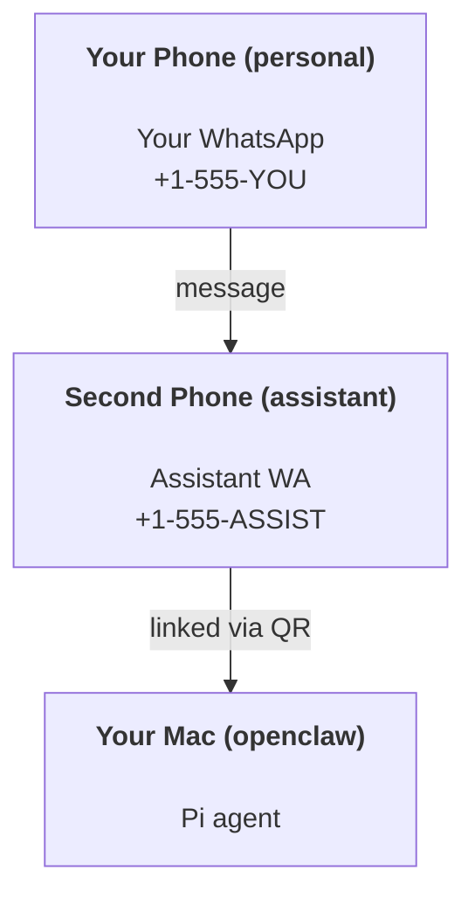

# パーソナルアシスタント設定

# OpenClawを使ったパーソナルアシスタントの構築

OpenClawは、**Pi**エージェント用のWhatsApp + Telegram + Discord + iMessageゲートウェイです。プラグインでMattermostが追加されます。このガイドは「パーソナルアシスタント」設定で、常に稼働しているエージェントのように振る舞う専用のWhatsApp番号を設定します。

## ⚠️ 安全第一

あなたはエージェントを以下のような位置に置くことになります：

* あなたのマシンでコマンドを実行する（あなたのPiツール設定によります）
* ワークスペース内のファイルを読み書きする
* WhatsApp/Telegram/Discord/Mattermost（プラグイン）を介してメッセージを送信する

慎重に始めましょう：

* 常に`channels.whatsapp.allowFrom`を設定してください（個人用Macでオープンにすることは避けてください）。
* アシスタント用に専用のWhatsApp番号を使用してください。
* ハートビートは現在、30分ごとがデフォルトです。設定を信頼するまで無効にするには、`agents.defaults.heartbeat.every: "0m"`を設定してください。

## 前提条件

* OpenClawがインストールされ、オンボーディングが完了していること — まだの場合は[Getting Started](/start/getting-started)を参照してください
* アシスタント用の別の電話番号（SIM/eSIM/プリペイド）

## 二つの電話設定（推奨）

あなたはこれを望んでいます：



あなたの個人用WhatsAppをOpenClawにリンクすると、あなたへのすべてのメッセージが「エージェント入力」となります。それは通常、あなたが望むものではありません。

## 5分で始めるクイックスタート

1. WhatsApp Webをペアリングする（QRを表示；アシスタント用電話でスキャン）：

```bash
openclaw channels login
```

2. ゲートウェイを起動する（実行し続ける）：

```bash
openclaw gateway --port 18789
```

3. `~/.openclaw/openclaw.json`に最小限の設定を入れる：

```json5
{
  channels: { whatsapp: { allowFrom: ["+15555550123"] } },
}
```

許可リストにある電話からアシスタント番号にメッセージを送信してください。

オンボーディングが完了すると、ダッシュボードが自動的に開き、クリーンな（トークン化されていない）リンクが表示されます。認証を求められた場合は、`gateway.auth.token`からトークンをControl UI設定に貼り付けてください。後で再度開くには：`openclaw dashboard`。

## エージェントにワークスペースを提供する（AGENTS）

OpenClawは、ワークスペースディレクトリから操作指示と「メモリ」を読み取ります。

デフォルトでは、OpenClawは`~/.openclaw/workspace`をエージェントのワークスペースとして使用し、設定時または最初のエージェント実行時に自動的に作成します（スタート用の`AGENTS.md`、`SOUL.md`、`TOOLS.md`、`IDENTITY.md`、`USER.md`、`HEARTBEAT.md`が含まれます）。`BOOTSTRAP.md`はワークスペースが新しいときのみ作成されます（削除後は戻ってきません）。`MEMORY.md`はオプション（自動作成されません）；存在する場合は、通常のセッションで読み込まれます。サブエージェントセッションは`AGENTS.md`と`TOOLS.md`のみを注入します。

ヒント：このフォルダをOpenClawの「メモリ」として扱い、gitリポジトリ（理想的にはプライベート）にして、`AGENTS.md`とメモリファイルをバックアップしてください。gitがインストールされている場合、新しいワークスペースは自動的に初期化されます。

```bash
openclaw setup
```

完全なワークスペースレイアウト + バックアップガイド：[Agent workspace](/concepts/agent-workspace)
メモリワークフロー：[Memory](/concepts/memory)

オプション：`agents.defaults.workspace`を使用して異なるワークスペースを選択できます（`~`をサポート）。

```json5
{
  agent: {
    workspace: "~/.openclaw/workspace",
  },
}
```

リポジトリから独自のワークスペースファイルを配信している場合、ブートストラップファイルの作成を完全に無効にできます：

```json5
{
  agent: {
    skipBootstrap: true,
  },
}
```

## 「アシスタント」に変える設定

OpenClawは良好なアシスタント設定をデフォルトで提供しますが、通常は以下を調整したいでしょう：

* `SOUL.md`のペルソナ/指示
* 思考のデフォルト（必要に応じて）
* ハートビート（信頼できるようになったら）

例：

```json5
{
  logging: { level: "info" },
  agent: {
    model: "anthropic/claude-opus-4-6",
    workspace: "~/.openclaw/workspace",
    thinkingDefault: "high",
    timeoutSeconds: 1800,
    // 最初は0から始めて、後で有効にします。
    heartbeat: { every: "0m" },
  },
  channels: {
    whatsapp: {
      allowFrom: ["+15555550123"],
      groups: {
        "*": { requireMention: true },
      },
    },
  },
  routing: {
    groupChat: {
      mentionPatterns: ["@openclaw", "openclaw"],
    },
  },
  session: {
    scope: "per-sender",
    resetTriggers: ["/new", "/reset"],
    reset: {
      mode: "daily",
      atHour: 4,
      idleMinutes: 10080,
    },
  },
}
```

## セッションとメモリ

* セッションファイル：`~/.openclaw/agents/<agentId>/sessions/{{SessionId}}.jsonl`
* セッションメタデータ（トークン使用、最後のルートなど）：`~/.openclaw/agents/<agentId>/sessions/sessions.json`（レガシー：`~/.openclaw/sessions/sessions.json`）
* `/new`または`/reset`は、そのチャットの新しいセッションを開始します（`resetTriggers`で設定可能）。単独で送信された場合、エージェントはリセットを確認するために短い挨拶を返します。
* `/compact [instructions]`はセッションコンテキストを圧縮し、残りのコンテキスト予算を報告します。

## ハートビート（プロアクティブモード）

デフォルトでは、OpenClawは30分ごとにハートビートを実行し、プロンプトは次のようになります：
`HEARTBEAT.mdが存在する場合はそれを読みます（ワークスペースコンテキスト）。厳密に従ってください。以前のチャットから古いタスクを推測したり繰り返したりしないでください。注意が必要なことがなければ、HEARTBEAT_OKと返信してください。`
`agents.defaults.heartbeat.every: "0m"`を設定して無効にします。

* `HEARTBEAT.md`が存在するが実質的に空（空白行と`# Heading`のようなマークダウンヘッダーのみ）であれば、OpenClawはAPIコールを節約するためにハートビート実行をスキップします。
* ファイルが欠落している場合、ハートビートは依然として実行され、モデルが何をするかを決定します。
* エージェントが`HEARTBEAT_OK`で応答した場合（オプションで短いパディングを含む；`agents.defaults.heartbeat.ackMaxChars`を参照）、OpenClawはそのハートビートのアウトバウンド配信を抑制します。
* デフォルトでは、DMスタイルの`user:<id>`ターゲットへのハートビート配信が許可されています。`agents.defaults.heartbeat.directPolicy: "block"`を設定して、ハートビート実行をアクティブに保ちながら、直接ターゲットへの配信を抑制します。
* ハートビートは完全なエージェントターンを実行します — 短い間隔はより多くのトークンを消費します。

```json5
{
  agent: {
    heartbeat: { every: "30m" },
  },
}
```

## メディアの入出力

受信添付ファイル（画像/音声/ドキュメント）は、テンプレートを介してコマンドに表示できます：

* `{{MediaPath}}`（ローカル一時ファイルパス）
* `{{MediaUrl}}`（擬似URL）
* `{{Transcript}}`（音声転写が有効な場合）

エージェントからの送信添付ファイル：そのままの行に`MEDIA:<path-or-url>`を含めます（スペースなし）。例：

```
こちらがスクリーンショットです。
MEDIA:https://example.com/screenshot.png
```

OpenClawはこれらを抽出し、テキストと一緒にメディアとして送信します。

## 操作チェックリスト

```bash
openclaw status          # ローカルステータス（クレデンシャル、セッション、キューイベント）
openclaw status --all    # 完全診断（読み取り専用、ペースト可能）
openclaw status --deep   # ゲートウェイのヘルスプローブを追加（Telegram + Discord）
openclaw health --json   # ゲートウェイのヘルススナップショット（WS）
```

ログは`/tmp/openclaw/`の下にあります（デフォルト：`openclaw-YYYY-MM-DD.log`）。

## 次のステップ

* WebChat: [WebChat](/web/webchat)
* ゲートウェイ操作: [Gateway runbook](/gateway)
* Cron + ウェイクアップ: [Cron jobs](/automation/cron-jobs)
* macOSメニューバーコンパニオン: [OpenClaw macOS app](/platforms/macos)
* iOSノードアプリ: [iOS app](/platforms/ios)
* Androidノードアプリ: [Android app](/platforms/android)
* Windowsステータス: [Windows (WSL2)](/platforms/windows)
* Linuxステータス: [Linux app](/platforms/linux)
* セキュリティ: [Security](/gateway/security)